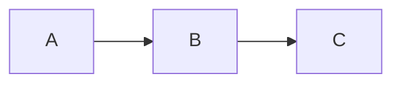

# Sync Docs Skill

Update `docs/features/` after major code changes.

## When to Use
- After completing a feature or fix
- When documentation is mentioned as outdated
- After significant refactoring
- When user asks to "update docs"

## Prerequisites
- You have just completed a code change
- You know which files were modified

## Process

### 1. Identify Changed Components
Focus on:
- `src/main/` (backend logic)
- `src/renderer/` (UI components)
- `src/shared/` (types, constants)
- `src/features/` (feature modules)

### 2. List Existing Docs
```bash
ls docs/features/
head -20 docs/features/*.md
```

### 3. Determine Action
For each changed component:
- **UPDATE**: Feature already has documentation
- **CREATE**: New feature, needs new doc
- **SKIP**: Minor change, already covered

### 4. Documentation Template

```markdown
# Feature Name

## Overview
One paragraph explaining what this feature does.

## Architecture
- **Service/File:** `src/main/path/to/file.ts`
- **Dependencies:** List key dependencies

## Key Components

### Component 1
Explanation...

### Component 2
Explanation...

## Data Flow (optional)


## Configuration (if applicable)
| Setting | Type | Default | Description |
|---------|------|---------|-------------|
| ...     | ...  | ...     | ...         |

## Hotfixes / Changelog (optional)
### Hotfix YYYY-MM-DD: Brief Title
- **Problem:** What was broken
- **Solution:** How it was fixed
```

### 5. Write Updates
- **UPDATE**: Use `view_file` → `replace_file_content`
- **CREATE**: Use `write_to_file` with template

### 6. Verify Links
Ensure file paths in docs are correct (use backticks).

### 7. Summary
Report what was done:
- Updated: `docs/features/foo.md` (added XYZ section)
- Created: `docs/features/bar.md` (new feature doc)
