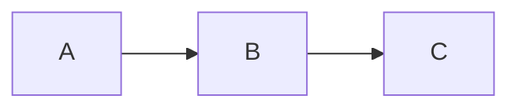

# Documentation Sync Workflow

This workflow updates `docs/features/` after major code changes.

## Prerequisites
- You have just completed a code change (feature, fix, refactor)
- You know which files were modified

## Steps

### 1. Identify Changed Components
List the main files that were modified in the recent change. Focus on:
- `src/main/` (backend logic)
- `src/renderer/` (UI components)
- `src/shared/` (types, constants)

### 2. List Existing Feature Docs
// turbo
```bash
ls docs/features/
```

### 3. Read Doc Names and Summaries
For each doc, read the first 20 lines to understand its scope:
// turbo
```bash
head -20 docs/features/*.md
```

### 4. Determine Action
For each changed component, decide:
- **UPDATE** an existing doc if the feature already has documentation
- **CREATE** a new doc if this is a new feature or subsystem
- **SKIP** if the change is minor and already covered

### 5. Documentation Standards
Each feature doc should follow this template:

```markdown
# Feature Name

## Overview
One paragraph explaining what this feature does.

## Architecture
- **Service/File:** `src/main/path/to/file.ts`
- **Dependencies:** List key dependencies

## Key Components

### Component 1
Explanation...

### Component 2
Explanation...

## Data Flow (optional)
Use mermaid diagrams for complex flows:


## Configuration (if applicable)
| Setting | Type | Default | Description |
|---------|------|---------|-------------|
| ...     | ...  | ...     | ...         |

## Hotfixes / Changelog (optional)
Document significant bug fixes with dates:
### Hotfix YYYY-MM-DD: Brief Title
- **Problem:** What was broken
- **Solution:** How it was fixed
```

### 6. Write Updates
- If **UPDATE**: Use `view_file` to read the existing doc, then `replace_file_content` to add/modify sections.
- If **CREATE**: Use `write_to_file` to create a new doc following the template above.

### 7. Verify Links
Ensure any file paths mentioned in docs are correct (use backticks for paths).

### 8. Summary
After completion, list what was updated/created:
- Updated: `docs/features/foo.md` (added XYZ section)
- Created: `docs/features/bar.md` (new feature doc)
